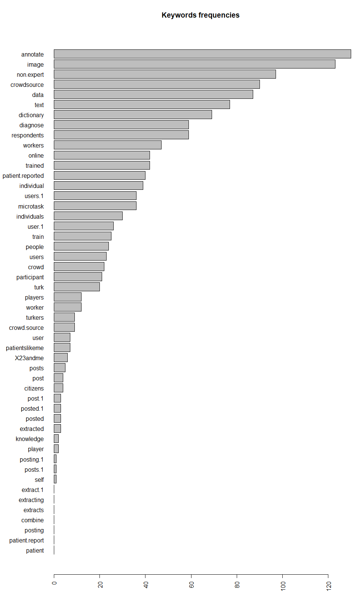
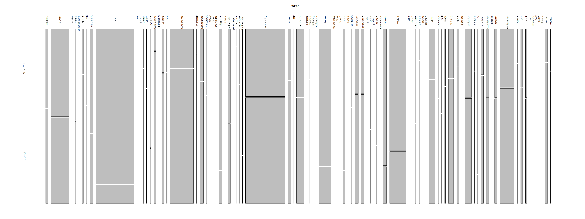
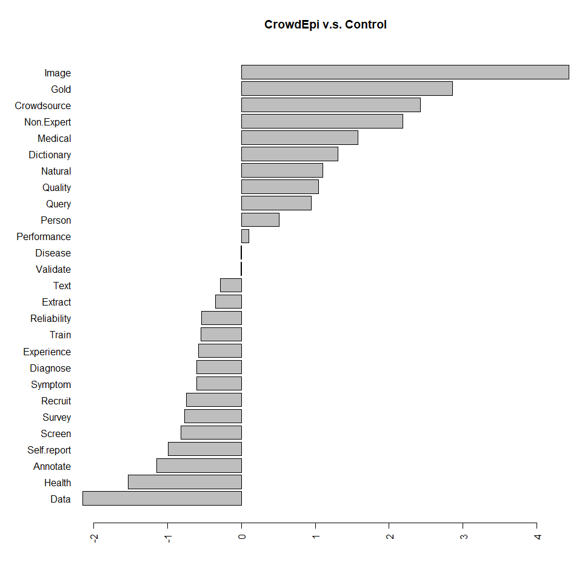
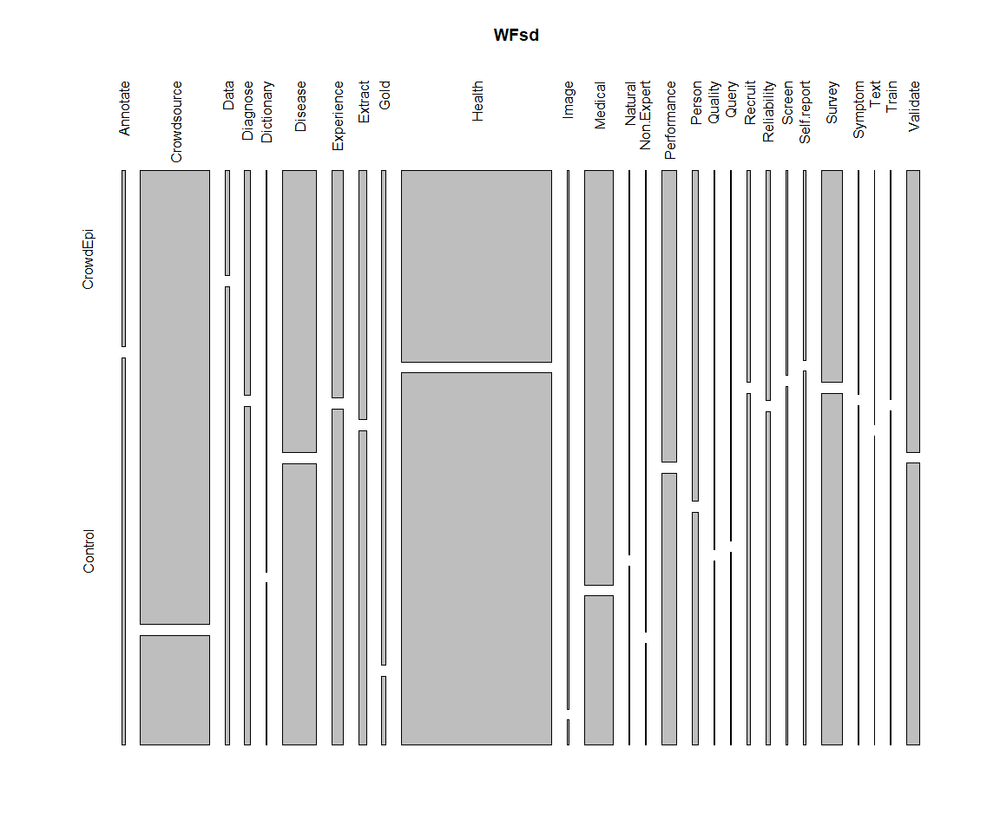
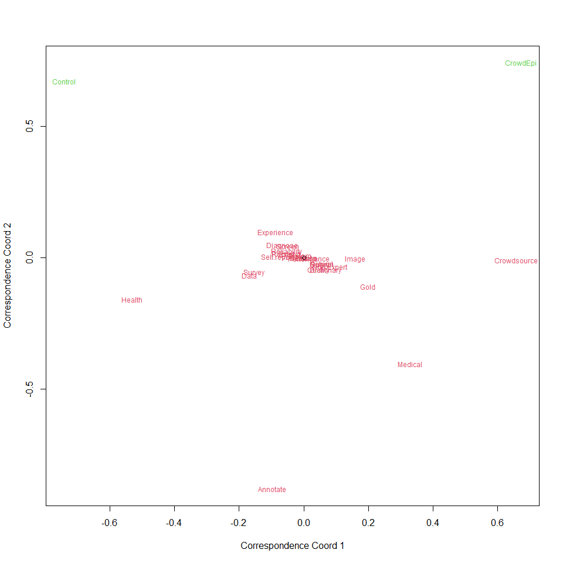

```{=html}
<style type="text/css">
    #header {
        text-align: center;
    }
</style>
```


### 1. Read the dictionary

```r
d=read.csv("crowd2Xu/Dictionary Maker/output/CrowdEpi.csv")
newd=data.frame(
  Annotate=d$annotate+d$annotated,#;newd=subset(newd,select=-c(annotated))
  #Combine=d$combine,0
  Crowdsource=d$crowd+d$crowdsource+d$crowd.source+d$crowdsourced+d$crowd.sourced+d$crowdsourcing+d$crowd.sourcing+d$X23andme+d$patientslikeme+d$citizen+d$citizens+d$turk+d$amazon+d$microtask,
  Data=d$data,
  Diagnose=d$diagnose+d$diagnosis,
  Dictionary=d$dictionary,
  Disease=d$disease+d$diseases+d$flu+d$virus,
  Experience=d$experience+d$experienced,
  Extract=d$extract+d$extraction+d$extraction.1+d$extracted,
  Gold=d$gold,
  Health=d$health,
  Image=d$image,
  #Knowledge=d$knowledge,0
  Medical=d$medical,
  #Media=d$media
  Natural=d$natural,
  Non.Expert=d$non.expert,
  Online=d$online+d$online.1,#+d$online.2
  Performance=d$performance,
  Person=d$user+d$user.1+d$users+d$users.1+d$player+d$players+d$individual+d$individuals+d$turkers+d$respondents+d$workers+d$participant+d$participants+d$people,
  Post=d$post.1+d$posting.1+d$posts.1+d$post+d$posts,
  Quality=d$quality,
  Query=d$query,
  Recruit=d$recruit+d$recruitment,
  Reliability=d$reliability,
  Screen=d$screen,
  Self.report=d$self.report+d$self.reported+d$patient.reported,
  Survey=d$survey,
  Symptom=d$symptom,
  Text=d$text,
  Train=d$train+d$trained,
  #d$tweet
  Validate=d$validate+d$validated+d$validation,
  Numword=d$numWord
)
md=as.matrix(newd)
head(md[,c(30,1:7)],20)
```

```
##       Numword Annotate Crowdsource Data Diagnose Dictionary Disease Experience
##  [1,]    5006        0           1    0        3          0       0          1
##  [2,]    2675        0           4    0        0          0       0          1
##  [3,]    5756        1         110    0        4          0       1          2
##  [4,]    3934        0          13    0        0          0       2          1
##  [5,]    8963        0           0    0        0          0       1          0
##  [6,]    3147        0           8    0       11          0       4          1
##  [7,]    5553        0           6    0        1          0      12          1
##  [8,]    5759        0           2    0        0          0       2          1
##  [9,]    4776        0           2    0        0          0      19          4
## [10,]    4926        0          23    0        0          0       7          3
## [11,]    4382        0           1    0        0          0       0          1
## [12,]    3828        0          23    0        0          0       1          0
## [13,]    5076        1           9    1        0          0      30          3
## [14,]    8125        0         244    4        5          0       9          6
## [15,]    9638        0          27    0        1          0      52          6
## [16,]    4640        0          10    0       33          0       6          5
## [17,]    4496        0           8    0        1          0      34          4
## [18,]    4018        0          12    1        0          0      11          0
## [19,]   13258        0          31    0        0          0       0          9
## [20,]    4766        0          95    0        0          0       0          2
```

```r
d2=read.csv("crowd2Xu/Dictionary Maker/output/Bogus.csv")
newd2=data.frame(
  Annotate=d2$annotate+d2$annotated,#;newd=subset(newd,select=-c(annotated))
  #Combine=d2$combine,0
  Crowdsource=d2$crowd+d2$crowdsource+d2$crowd.source+d2$crowdsourced+d2$crowd.sourced+d2$crowdsourcing+d2$crowd.sourcing+d2$X23andme+d2$patientslikeme+d2$citizen+d2$citizens+d2$turk+d2$amazon+d2$microtask,
  Data=d2$data,
  Diagnose=d2$diagnose+d2$diagnosis,
  Dictionary=d2$dictionary,
  Disease=d2$disease+d2$diseases+d2$flu+d2$virus,
  Experience=d2$experience+d2$experienced,
  Extract=d2$extract+d2$extraction+d2$extraction.1+d2$extracted,
  Gold=d2$gold,
  Health=d2$health,
  Image=d2$image,
  #Knowledge=d2$knowledge,0
  Medical=d2$medical,
  #Media=d2$media
  Natural=d2$natural,
  Non.Expert=d2$non.expert,
  Online=d2$online+d2$online.1,#+d2$online.2
  Performance=d2$performance,
  Person=d2$user+d2$user.1+d2$users+d2$users.1+d2$player+d2$players+d2$individual+d2$individuals+d2$turkers+d2$respondents+d2$workers+d2$participant+d2$participants+d2$people,
  Post=d2$post.1+d2$posting.1+d2$posts.1+d2$post+d2$posts,
  Quality=d2$quality,
  Query=d2$query,
  Recruit=d2$recruit+d2$recruitment,
  Reliability=d2$reliability,
  Screen=d2$screen,
  Self.report=d2$self.report+d2$self.reported+d2$patient.reported,
  Survey=d2$survey,
  Symptom=d2$symptom,
  Text=d2$text,
  Train=d2$train+d2$trained,
  #d2$tweet
  Validate=d2$validate+d2$validated+d2$validation,
  Numword=d2$numWord
)
md2=as.matrix(newd2)
head(md2[,c(30,1:7)],20)
```

```
##       Numword Annotate Crowdsource Data Diagnose Dictionary Disease Experience
##  [1,]    2963        0           7    0        0          0       0          1
##  [2,]    4361        0           4    0        0          1       0          1
##  [3,]    8628        0          36    1        0          0      10          0
##  [4,]   11592        0          32    0        0          0       0          0
##  [5,]    6508        0           6    0        0          0       3          0
##  [6,]    4909        0           2    0        0          0       0          3
##  [7,]   14758        1          62    2        0          1       0          2
##  [8,]    5075        0           2    0        0          0       1         15
##  [9,]    4150        0          15    0        0          0       0          0
## [10,]    3703       10          10    0        0          0       0          0
## [11,]    3417        0           2    0        0          0       1          0
## [12,]    6769        0           9    0        0          0       4          0
## [13,]    7720        0           4    1        0          0       0          0
## [14,]    4569        6          52    0        0          0       1          1
## [15,]    4592        0          19    0        0          0       0          1
## [16,]   13335        0           5    1        0          0       0          2
## [17,]    2900        0           5    0        0          0       0          4
## [18,]    6405        0           2    0        0          0       2          1
## [19,]    8588        1          28    0        1          0      32          0
## [20,]   16659        0           1    0        0          1       0          1
```

### 2. Prepare the data

```r
s=colSums(md)
s2=colSums(md2)
r=s[length(s)]/s2[length(s2)]
s[s==0]=0.1*r
s2[s2==0]=0.1
WF=cbind(t(t(s)),t(t(s2)))
colnames(WF)=c('CrowdEpi','Control')
# WF_print=cbind(colnames(newd),
#   formatC(as.numeric(WF[,1]),format="f",digits=2),
#   formatC(as.numeric(WF[,2]),format="f",digits=2))
# colnames(WF_print)=c('key_word','CrowdEpi','Control')
# WF_print
WF
```

```
##             CrowdEpi Control
## Annotate         225     229
## Crowdsource     6551    3715
## Data              46      44
## Diagnose         744      60
## Dictionary        49      20
## Disease         3728     303
## Experience       981     481
## Extract          738     501
## Gold             179     111
## Health          9036     339
## Image             76      49
## Medical         3015     403
## Natural          103      29
## Non.Expert        63      32
## Online           190      32
## Performance     1388    1498
## Person           344     154
## Post               8       5
## Quality          114     102
## Query            134     154
## Recruit          702     189
## Reliability      389     311
## Screen           207     157
## Self.report      519     150
## Survey          2396     737
## Symptom          289      42
## Text              55      22
## Train             33      39
## Validate        1101     554
## Numword      2369845 1417653
```

### 3. Analysis of Log Odds Ratio
$$\text{Log Odds Ratio }=\log_2(\frac{\frac{\text{Number of occourance per term in CrowdEpi}}{\text{Number of occourance of all the terms in CrowdEpi - Number of occourance per term in CrowdEpi}}}{\frac{\text{Number of occourance per term in Control}}{\text{Number of occourance of all the terms in Control - Number of occourance per term in Control}}})$$

```r
#$$\text{Log Odds Ratio }=\log_2(\frac{\frac{\text{Number of occourance per term for CrowdEpi}}{\text{Number of total words for CrowdEpi}}}{\frac{\text{Number of occourance per term for Bogus}}{\text{Number of total words for Bogus}}})$$
par(las=2,mar=c(5,7,4,1)+.1)
#LOR=log2(WF[,1][-length(WF)/2]/WF[,2][-length(WF)/2]*WF[,2][length(WF)/2]/WF[,1][length(WF)/2])
WF2=WF[-length(WF)/2,]
LOR=log2(WF2[,1]/WF2[,2]*(colSums(WF2)[2]-WF2[,2])/(colSums(WF2)[1]-WF2[,1]))
barplot((sort(LOR,decreasing=FALSE)),horiz=TRUE,main="CrowdEpi v.s. Control")
```

<!-- -->

### 4. Conditional Mosaic (Standardized)

```r
#mosaicplot(WF2)
library(vcd)
WFsd=cbind(WF2[,1]/colSums(WF2)[1],WF2[,2]/colSums(WF2)[2])
colnames(WFsd)=c('CrowdEpi','Control')
mosaicplot(WFsd,las=3,cex.axis=1)
```

<!-- -->


### 5. Correspondence Analysis

```r
cc=function(x, printout=FALSE){
 rsum=apply(x,1,sum)
 csum=apply(x,2,sum)
 n=sum(x)
 rsum=matrix(rsum,ncol=1)
 csum=matrix(csum,ncol=1)
 ee=rsum %*% t(csum)/n
 cc=(x-ee)/sqrt(ee)
 d=svd(cc)
 I=dim(x)[1]
 J=dim(x)[2]
 xs=sum((d$d^2))
 pv=1-pchisq(xs,(I-1)*(J-1))
 y=rbind(d$u,d$v)
 plot(y[, 1], y[, 2], type = "n", xlab = "Correspondence Coord 1", ylab = "Correspondence Coord 2")
 text(y[,1],y[,2],c(dimnames(x)[[1]],dimnames(x)[[2]]),col=c(rep(2,I),rep(3,J)),cex=0.75)
 points(0,0)
 intertia=sum((d$d[1:2]^2))/xs
 if(printout) list(pvalue=pv,xsq=xs,inertia=intertia,rsum=rsum,csum=csum)
}

cc(WF2)
```

<!-- -->

### 6. Original data analysis

```r
files=list.files(path='data-files/files/',pattern='*.txt',full.names=FALSE)
files188=gsub("\\..*","",files)
un=read.csv("original_data.csv",sep=';')
rownames(un)=gsub("\\..*","",un$filename)
#un$filename=gsub("\\..*","",un$filename)
index_CrowdEpi=intersect(files188,rownames(un))
index_control=setdiff(rownames(un),index_CrowdEpi)
d=un[index_CrowdEpi,]
newd=data.frame(
  Annotate=d$annotate+d$annotated,#;newd=subset(newd,select=-c(annotated))
  #Combine=d$combine,0
  Crowdsource=d$crowd+d$crowdsource+d$crowd.source+d$crowdsourced+d$crowd.sourced+d$crowdsourcing+d$crowd.sourcing+d$X23andme+d$patientslikeme+d$citizen+d$citizens+d$turk+d$amazon+d$microtask,
  Data=d$data,
  Diagnose=d$diagnose+d$diagnosis,
  Dictionary=d$dictionary,
  Disease=d$disease+d$diseases+d$flu+d$virus,
  Experience=d$experience+d$experienced,
  Extract=d$extract+d$extraction+d$extraction.1,#+d$extracted-----
  Gold=d$gold,
  Health=d$health,
  Image=d$image,
  #Knowledge=d$knowledge,0
  Medical=d$medical,
  #Media=d$media
  Natural=d$natural,
  Non.Expert=d$non.expert,
  #Online=d$online+d$online.1,#+d$online.2-----
  Performance=d$performance,
  Person=d$user+d$user.1+d$users+d$users.1+d$player+d$players+d$individual+d$individuals+d$turkers+d$respondents+d$workers+d$participant+d$participants+d$people,
  #Post=d$post.1+d$posting.1+d$posts.1+d$post+d$posts,-----
  Quality=d$quality,
  Query=d$query,
  Recruit=d$recruit+d$recruitment,
  Reliability=d$reliability,
  Screen=d$screen,
  Self.report=d$self.report+d$self.reported+d$patient.reported,
  Survey=d$survey,
  Symptom=d$symptom,
  Text=d$text,
  Train=d$train+d$trained,
  #d$tweet
  Validate=d$validate+d$validated+d$validation,
  Numword=d$numWord
)
md=as.matrix(newd)
#head(md[,c(30,1:7)],20)

d2=un[index_control,]
newd2=data.frame(
  Annotate=d2$annotate+d2$annotated,#;newd=subset(newd,select=-c(annotated))
  #Combine=d2$combine,0
  Crowdsource=d2$crowd+d2$crowdsource+d2$crowd.source+d2$crowdsourced+d2$crowd.sourced+d2$crowdsourcing+d2$crowd.sourcing+d2$X23andme+d2$patientslikeme+d2$citizen+d2$citizens+d2$turk+d2$amazon+d2$microtask,
  Data=d2$data,
  Diagnose=d2$diagnose+d2$diagnosis,
  Dictionary=d2$dictionary,
  Disease=d2$disease+d2$diseases+d2$flu+d2$virus,
  Experience=d2$experience+d2$experienced,
  Extract=d2$extract+d2$extraction+d2$extraction.1,#+d2$extracted
  Gold=d2$gold,
  Health=d2$health,
  Image=d2$image,
  #Knowledge=d2$knowledge,0
  Medical=d2$medical,
  #Media=d2$media
  Natural=d2$natural,
  Non.Expert=d2$non.expert,
  #Online=d2$online+d2$online.1,#+d2$online.2
  Performance=d2$performance,
  Person=d2$user+d2$user.1+d2$users+d2$users.1+d2$player+d2$players+d2$individual+d2$individuals+d2$turkers+d2$respondents+d2$workers+d2$participant+d2$participants+d2$people,
  #Post=d2$post.1+d2$posting.1+d2$posts.1+d2$post+d2$posts,
  Quality=d2$quality,
  Query=d2$query,
  Recruit=d2$recruit+d2$recruitment,
  Reliability=d2$reliability,
  Screen=d2$screen,
  Self.report=d2$self.report+d2$self.reported+d2$patient.reported,
  Survey=d2$survey,
  Symptom=d2$symptom,
  Text=d2$text,
  Train=d2$train+d2$trained,
  #d2$tweet
  Validate=d2$validate+d2$validated+d2$validation,
  Numword=d2$numWord
)
md2=as.matrix(newd2)

s=colSums(md)
s2=colSums(md2)
r=s[length(s)]/s2[length(s2)]
s[s==0]=0.1*r
s2[s2==0]=0.1
WF=cbind(t(t(s)),t(t(s2)))
colnames(WF)=c('CrowdEpi','Control')
# WF_print=cbind(colnames(newd),
#   formatC(as.numeric(WF[,1]),format="f",digits=2),
#   formatC(as.numeric(WF[,2]),format="f",digits=2))
# colnames(WF_print)=c('key_word','CrowdEpi','Control')
# WF_print
WF
```

```
##             CrowdEpi Control
## Annotate          16      29
## Crowdsource      789     157
## Data              10      36
## Diagnose          33      41
## Dictionary        15       5
## Disease          241     198
## Experience        64      78
## Extract           48      50
## Gold              52       6
## Health           719    1153
## Image             26       1
## Medical          300      89
## Natural           13       5
## Non.Expert        11       2
## Performance      113      87
## Person            50      29
## Quality           10       4
## Query             14       6
## Recruit           19      26
## Reliability       26      31
## Screen             9      13
## Self.report       16      26
## Survey           112     153
## Symptom            4       5
## Text               3       3
## Train              5       6
## Validate          97      80
## Numword       238928  239763
```

#### Analysis of Log Odds Ratio

```r
#$$\text{Log Odds Ratio }=\log_2(\frac{\frac{\text{Number of occourance per term for CrowdEpi}}{\text{Number of total words for CrowdEpi}}}{\frac{\text{Number of occourance per term for Bogus}}{\text{Number of total words for Bogus}}})$$
par(las=2,mar=c(5,7,4,1)+.1)
#LOR=log2(WF[,1][-length(WF)/2]/WF[,2][-length(WF)/2]*WF[,2][length(WF)/2]/WF[,1][length(WF)/2])
WF2=WF[-length(WF)/2,]
LOR=log2(WF2[,1]/WF2[,2]*(colSums(WF2)[2]-WF2[,2])/(colSums(WF2)[1]-WF2[,1]))
barplot((sort(LOR,decreasing=FALSE)),horiz=TRUE,main="CrowdEpi v.s. Control")
```

<!-- -->

#### Conditional Mosaic (Standardized)

```r
#mosaicplot(WF2)
library(vcd)
WFsd=cbind(WF2[,1]/colSums(WF2)[1],WF2[,2]/colSums(WF2)[2])
colnames(WFsd)=c('CrowdEpi','Control')
mosaicplot(WFsd,las=3,cex.axis=1)
```

<!-- -->

#### Correspondence Analysis

```r
cc=function(x, printout=FALSE){
 rsum=apply(x,1,sum)
 csum=apply(x,2,sum)
 n=sum(x)
 rsum=matrix(rsum,ncol=1)
 csum=matrix(csum,ncol=1)
 ee=rsum %*% t(csum)/n
 cc=(x-ee)/sqrt(ee)
 d=svd(cc)
 I=dim(x)[1]
 J=dim(x)[2]
 xs=sum((d$d^2))
 pv=1-pchisq(xs,(I-1)*(J-1))
 y=rbind(d$u,d$v)
 plot(y[, 1], y[, 2], type = "n", xlab = "Correspondence Coord 1", ylab = "Correspondence Coord 2")
 text(y[,1],y[,2],c(dimnames(x)[[1]],dimnames(x)[[2]]),col=c(rep(2,I),rep(3,J)),cex=0.75)
 points(0,0)
 intertia=sum((d$d[1:2]^2))/xs
 if(printout) list(pvalue=pv,xsq=xs,inertia=intertia,rsum=rsum,csum=csum)
}

cc(WF2)
```

<!-- -->
