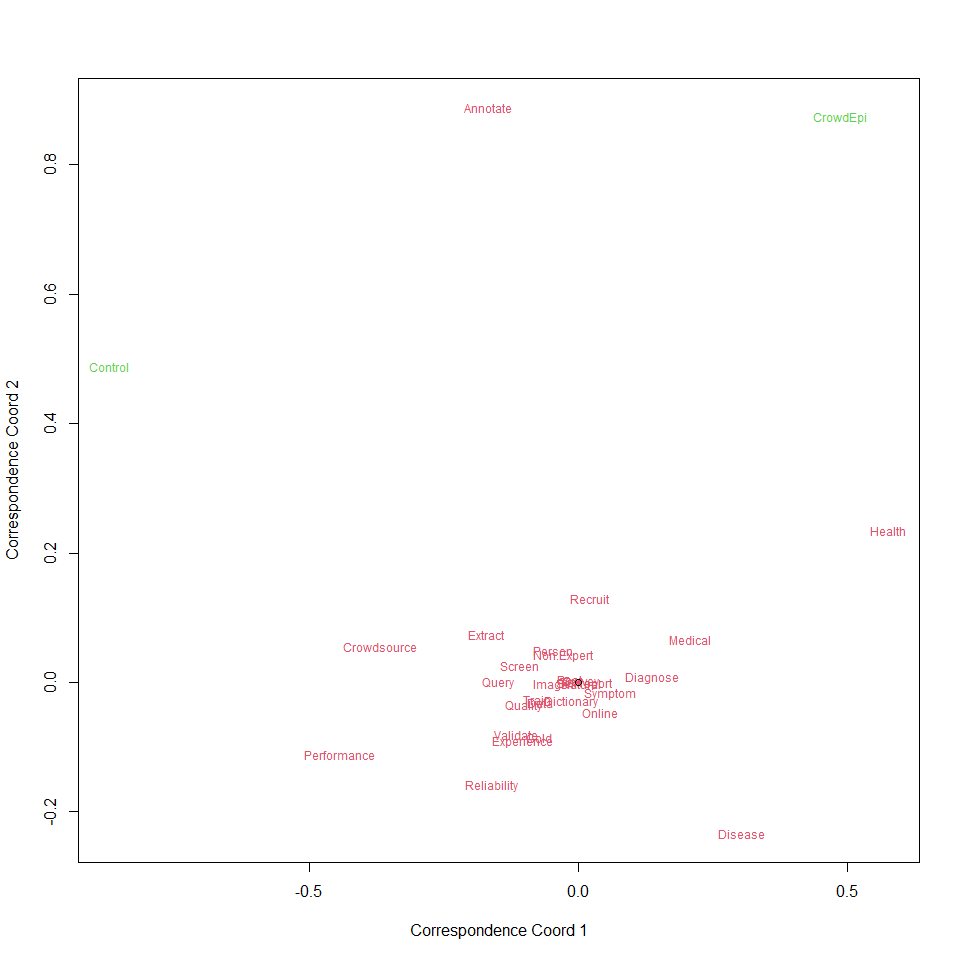

```{=html}
<style type="text/css">
    #header {
        text-align: center;
    }
</style>
```


### 1. Read the dictionary

```r
d=read.csv("crowd2Xu/Dictionary Maker/output/CrowdEpi.csv")
md=as.matrix(d[,2:dim(d)[2]])
head(md[,c(88,1:7)],20)
```

```
##       numWord validated survey worker natural patientslikeme quality text
##  [1,]    5006         0     50      0       0              0       0    0
##  [2,]    2675         1      0      0       0              0       0    0
##  [3,]    5756         0      6      0       1              0       0    0
##  [4,]    3934         0      0      0       0              0       0    0
##  [5,]    8963         1      0      0       0              0       2    0
##  [6,]    3147         1      1      0       0              0       0    0
##  [7,]    5553         5      5      0       0              0       0    0
##  [8,]    5759         0      2      0       0              0       0    0
##  [9,]    4776         1      0      0       0              0       0    0
## [10,]    4926         5     21      0       0              0       0    0
## [11,]    4382         2      5      0       0              0       0    0
## [12,]    3828         0      8      0       0              0       0    0
## [13,]    5076         0      1      0       0              0       0    0
## [14,]    8125         0      1      0       0              0       1    2
## [15,]    9638         2     10      0       0              0       0    3
## [16,]    4640         0     21      0       0              0       0    0
## [17,]    4496         1      5      0       0              0       0    0
## [18,]    4018         0      0      0       0              0       0    0
## [19,]   13258         0     23      0       0              0       0    0
## [20,]    4766         1      0      0       0              0       0    0
```

```r
d2=read.csv("crowd2Xu/Dictionary Maker/output/Bogus.csv")
md2=as.matrix(d2[,2:dim(d2)[2]])
head(md2[,c(88,1:7)],20)
```

```
##       numWord validated survey worker natural patientslikeme quality text
##  [1,]    2963         0      7      0       0              0       0    0
##  [2,]    4361         0      0      0       1              0       0    0
##  [3,]    8628         0      0      0       0              0       1    0
##  [4,]   11592         0      7      0       0              0       0    0
##  [5,]    6508         0      0      0       0              0       0    0
##  [6,]    4909         1      3      0       0              0       0    0
##  [7,]   14758         3      4      0       2              0       1    1
##  [8,]    5075         0      3      0       0              0       0    0
##  [9,]    4150         0      0      0       0              0       0    0
## [10,]    3703         0      0      0       0              0       0    0
## [11,]    3417         0      0      0       0              0       0    0
## [12,]    6769         0      1      0       0              0       0    0
## [13,]    7720         2      1      0       0              0       0    0
## [14,]    4569         0      1      0       0              0       0    0
## [15,]    4592         0      2      0       0              0       0    0
## [16,]   13335         0      1      0       1              0       0    0
## [17,]    2900         0     11      0       0              0       0    0
## [18,]    6405         0      0      0       0              0       0    0
## [19,]    8588         3      1      0       0              2       0    0
## [20,]   16659        14      4      0       0              0       0    0
```

### 2. Prepare the data

```r
s=colSums(md)
s2=colSums(md2)
show=cbind(t(t(s)),t(t(s2)))
colnames(show)=c('CrowdEpi','Control')
#(WF=show[(show[,1]>0)&(show[,2]>0),])
WF=show
WF[WF==0]<-0.1
WF
```

```
##                   CrowdEpi   Control
## validated            310.0     116.0
## survey              2396.0     737.0
## worker                 7.0       5.0
## natural              103.0      29.0
## patientslikeme         1.0       6.0
## quality              114.0     102.0
## text                  55.0      22.0
## recruitment          550.0     116.0
## health              9036.0     339.0
## user                   4.0       3.0
## patient                0.1       0.1
## trained               21.0      23.0
## user.1                18.0      11.0
## symptom              289.0      42.0
## crowd.sourcing        53.0     119.0
## participant           14.0       7.0
## validate             123.0     116.0
## data                  46.0      44.0
## performance         1388.0    1498.0
## microtask             15.0      29.0
## crowd.sourced        291.0     212.0
## non.expert            63.0      32.0
## player                 2.0       0.1
## crowd                 18.0       4.0
## knowledge              2.0       0.1
## diagnosis            695.0      50.0
## players                8.0       4.0
## self.reported        331.0      87.0
## patient.report         0.1       0.1
## citizens               1.0       3.0
## individuals           19.0      13.0
## patient.reported      34.0       4.0
## crowdsourcing       4075.0    2008.0
## screen               207.0     157.0
## self                   0.1       0.1
## experience           739.0     362.0
## extracted              0.1       3.0
## individual            22.0      17.0
## dictionary            49.0      20.0
## X23andme               2.0       4.0
## disease             2458.0     204.0
## respondents           53.0       6.0
## posts                  2.0       3.0
## posts.1                0.1       1.0
## virus                419.0      30.0
## people                13.0      10.0
## self.report          154.0      59.0
## extraction           302.0     160.0
## extraction.1         302.0     160.0
## posted                 3.0       0.1
## online                35.0       8.0
## posted.1               2.0       1.0
## online.1             155.0      24.0
## crowd.source           0.1       9.0
## diseases             721.0      61.0
## medical             3015.0     403.0
## users                 16.0       7.0
## users.1               21.0      15.0
## participants         125.0      33.0
## annotate              54.0      78.0
## posting                0.1       0.1
## posting.1              1.0       0.1
## citizen              481.0     373.0
## crowdsource           63.0      30.0
## turk                  15.0       5.0
## image                 76.0      49.0
## reliability          389.0     311.0
## query                134.0     154.0
## diagnose              49.0      10.0
## validation           668.0     322.0
## combine                0.1       0.1
## flu                  130.0       8.0
## annotated            171.0     151.0
## experienced          242.0     119.0
## extracts               0.1       0.1
## amazon               281.0     135.0
## crowdsourced        1255.0     778.0
## workers               21.0      27.0
## gold                 179.0     111.0
## recruit              152.0      73.0
## train                 12.0      16.0
## extracting             0.1       0.1
## post                   4.0       0.1
## post.1                 1.0       1.0
## turkers                8.0       1.0
## extract              134.0     178.0
## extract.1              0.1       0.1
## numWord          2369845.0 1417653.0
```

### 3. Analysis of Log Odds Ratio
$$\text{Log Odds Ratio }=\log_2(\frac{\frac{\text{Number of occourance per term in CrowdEpi}}{\text{Number of occourance of all the terms in CrowdEpi - Number of occourance per term in CrowdEpi}}}{\frac{\text{Number of occourance per term in Control}}{\text{Number of occourance of all the terms in Control - Number of occourance per term in Control}}})$$

```r
#$$\text{Log Odds Ratio }=\log_2(\frac{\frac{\text{Number of occourance per term for CrowdEpi}}{\text{Number of total words for CrowdEpi}}}{\frac{\text{Number of occourance per term for Bogus}}{\text{Number of total words for Bogus}}})$$
par(las=2,mar=c(5,7,4,1)+.1)
#LOR=log2(WF[,1][-length(WF)/2]/WF[,2][-length(WF)/2]*WF[,2][length(WF)/2]/WF[,1][length(WF)/2])
WF2=WF[-length(WF)/2,]
LOR=log2(WF2[,1]/WF2[,2]*(colSums(WF2)[2]-WF2[,2])/(colSums(WF2)[1]-WF2[,1]))
barplot((sort(LOR,decreasing=FALSE)),horiz=TRUE,main="CrowdEpi v.s. Control")
```

<!-- -->

### 4. Conditional Mosaic (Standardized)

```r
#mosaicplot(WF2)
library(vcd)
WFsd=cbind(WF2[,1]/colSums(WF2)[1],WF2[,2]/colSums(WF2)[2])
colnames(WFsd)=c('CrowdEpi','Control')
mosaicplot(WFsd,las=3,cex.axis=1)
```

<!-- -->


### 5. Correspondence Analysis

```r
cc=function(x, printout=FALSE){
 rsum=apply(x,1,sum)
 csum=apply(x,2,sum)
 n=sum(x)
 rsum=matrix(rsum,ncol=1)
 csum=matrix(csum,ncol=1)
 ee=rsum %*% t(csum)/n
 cc=(x-ee)/sqrt(ee)
 d=svd(cc)
 I=dim(x)[1]
 J=dim(x)[2]
 xs=sum((d$d^2))
 pv=1-pchisq(xs,(I-1)*(J-1))
 y=rbind(d$u,d$v)
 plot(y[, 1], y[, 2], type = "n", xlab = "Correspondence Coord 1", ylab = "Correspondence Coord 2")
 text(y[,1],y[,2],c(dimnames(x)[[1]],dimnames(x)[[2]]),col=c(rep(2,I),rep(3,J)),cex=0.75)
 points(0,0)
 intertia=sum((d$d[1:2]^2))/xs
 if(printout) list(pvalue=pv,xsq=xs,inertia=intertia,rsum=rsum,csum=csum)
}

cc(WF2)
```

<!-- -->


